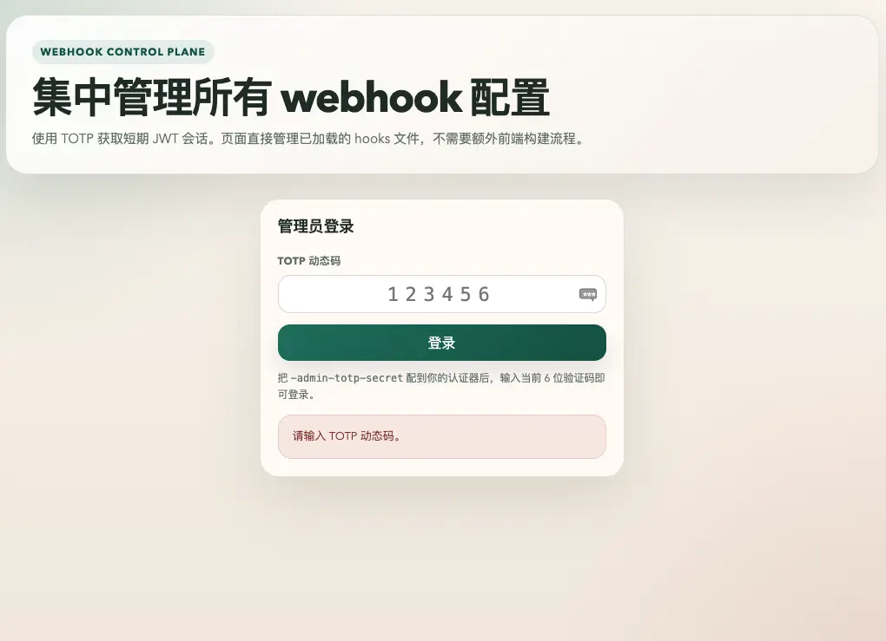
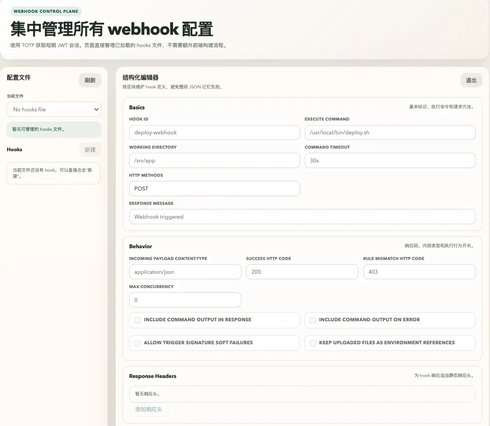
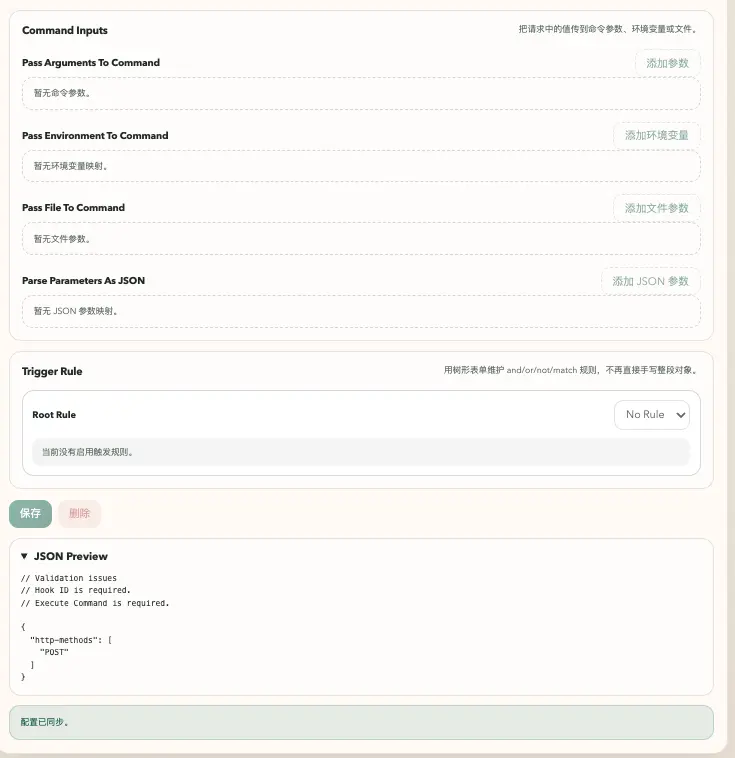

# webhook 中文使用指南

`webhook` 是一个用 Go 编写的轻量级 HTTP 回调服务。它可以把请求中的 header、query、payload、文件等数据映射到命令参数或环境变量，并在规则校验通过后执行指定命令。

本仓库是从 `adnanh/webhook` fork 而来的增强版本，仓库地址为 [xtulnx/webhook](https://github.com/xtulnx/webhook)。除了上游原有能力外，本版本补充了 YAML 总配置、Admin 管理界面、命令超时、并发限制、反向代理真实 IP、PID 文件、一键安装脚本、GitHub Release 编译发布流程和安全更新检查机制。



## 主要特性

- 支持 JSON/YAML hook 配置。
- 支持 `-c`、`-config`、`--config` 加载 YAML 总配置文件。
- 支持 Admin UI 在线管理已加载的 hooks 文件。
- Admin 登录使用 TOTP 动态验证码，登录后使用短期 JWT 会话。
- 支持全局和单 hook 的命令执行超时。
- 支持全局和单 hook 的并发执行限制。
- 支持反向代理后的真实客户端 IP 提取，适配 `ip-whitelist`。
- 支持 multipart 上传文件以临时环境变量形式传给命令。
- 支持 PID 文件、日志文件、热重载、自定义响应头、TLS、Unix socket。
- 提供 Linux/macOS/BSD 的 shell 一键安装脚本和 Windows PowerShell 一键安装脚本。
- 提供 GitHub Actions 自动编译、打包、校验和发布脚本。
- 支持通过 CLI 检查、应用和回滚已签名的 GitHub Release 更新。

## 快速安装或更新

Linux、macOS、FreeBSD、OpenBSD:

```bash
curl -fsSL https://raw.githubusercontent.com/xtulnx/webhook/master/scripts/install.sh | sh
```

Windows PowerShell:

```powershell
irm https://raw.githubusercontent.com/xtulnx/webhook/master/scripts/install.ps1 | iex
```

安装脚本默认安装最新 GitHub Release，并进行 SHA256 校验。再次执行同一条命令即可更新到最新版本。

可通过环境变量调整安装行为：

```bash
curl -fsSL https://raw.githubusercontent.com/xtulnx/webhook/master/scripts/install.sh | \
  WEBHOOK_VERSION=v2.8.4 WEBHOOK_INSTALL_DIR="$HOME/.local/bin" sh
```

PowerShell 示例：

```powershell
$env:WEBHOOK_VERSION = "v2.8.4"
$env:WEBHOOK_INSTALL_DIR = "$env:USERPROFILE\bin"
irm https://raw.githubusercontent.com/xtulnx/webhook/master/scripts/install.ps1 | iex
```

常用变量：

- `WEBHOOK_REPO`: GitHub 仓库，默认 `xtulnx/webhook`。
- `WEBHOOK_VERSION`: 版本 tag，默认 `latest`。
- `WEBHOOK_INSTALL_DIR`: 安装目录。Unix 默认 `/usr/local/bin`，Windows 默认 `%LOCALAPPDATA%\Programs\webhook`。
- `WEBHOOK_BINARY_NAME`: 安装后的 binary 名称，默认 `webhook` 或 `webhook.exe`。

## 从源码构建

需要 Go 1.21 或更新版本。

```bash
git clone https://github.com/xtulnx/webhook.git
cd webhook
go build
./webhook -version
```

运行测试：

```bash
go test ./...
```

## 更新 webhook 程序

更新命令默认使用 `xtulnx/webhook`，不需要设置 `repository`。更新状态文件默认放在当前工作目录，因此 `state-dir` 不是必需项；如果该目录不可写，可以显式指定一个可写目录。

```bash
# 检查最新版本
webhook update check

# 应用更新（会要求确认；脚本或 CI 可加 --yes）
webhook update apply --yes

# 指定版本或状态目录
webhook update apply --version v2.8.4 --state-dir /var/lib/webhook/update --yes

# 使用上一次更新保存的备份回滚
webhook update rollback --state-dir /var/lib/webhook/update
```

Release 清单优先使用内置 Ed25519 公钥验证。若部署环境尚未配置公钥，`check` 仍可工作，但 `apply` 默认拒绝未签名清单；仅在你明确接受 SHA256 校验而不做签名验证时使用 `--allow-unsigned`。

更新会下载对应平台的 Release 归档，校验 SHA256 和签名，验证新二进制的版本号后再替换当前文件，并保留 `webhook.previous`。更新不会自动重启正在运行的服务；使用 systemd 时请在更新后执行 `systemctl restart webhook`。Admin 页面只提供认证后的版本检查和状态展示，程序替换仍通过 CLI 执行。

生成本地 release 包：

```bash
make release
make release-windows
```

## 最小可用示例

创建 hook 文件 `hooks.yaml`：

```yaml
- id: deploy
  execute-command: /usr/local/bin/deploy.sh
  command-working-directory: /srv/app
  http-methods:
    - POST
  response-message: Deploy triggered
  trigger-rule:
    match:
      type: value
      value: my-secret
      parameter:
        source: header
        name: X-Webhook-Secret
```

启动服务：

```bash
webhook -hooks hooks.yaml -verbose
```

触发 hook：

```bash
curl -X POST \
  -H "X-Webhook-Secret: my-secret" \
  http://127.0.0.1:9000/hooks/deploy
```

默认监听地址是 `0.0.0.0:9000`，默认 hook URL 前缀是 `/hooks/`。

## 使用 YAML 总配置文件

本 fork 新增了总配置文件能力。可以把命令行参数写进 YAML 文件，再用 `-c`、`-config` 或 `--config` 启动。

示例 `webhook.yaml`：

```yaml
ip: 0.0.0.0
port: 1987
urlprefix: wh
hooks:
  - /etc/webhook/admin.yaml
  - /etc/webhook/hooks.yaml
hotreload: true
nopanic: true
verbose: true
logfile: /var/log/webhook.log
pidfile: /var/run/webhook.pid
command-timeout: 30s
max-concurrency: 4
```

启动：

```bash
webhook -c /etc/webhook/webhook.yaml
```

命令行参数优先级高于配置文件。例如：

```bash
webhook -c /etc/webhook/webhook.yaml -port 9000 -debug
```

完整示例可参考 [webhook.yaml.example](webhook.yaml.example)。

## Admin 管理界面

本 fork 内置 Admin UI 和 API，可在线查看、新增、编辑和删除已加载的 hooks 文件。



启用方式：

```yaml
admin: true
admin-path: admin
admin-totp-secret: "BASE32_TOTP_SECRET"
admin-jwt-secret: "replace-with-a-long-random-secret"
admin-session-ttl: 12h
```

启动后访问：

```text
http://127.0.0.1:1987/admin/
```

生成 TOTP Base32 密钥：

```bash
python3 -c 'import base64, os; print(base64.b32encode(os.urandom(20)).decode().rstrip("="))'
```

把生成的密钥配置到 Google Authenticator、Microsoft Authenticator、1Password 等认证器中，然后在 Admin 登录页输入当前 6 位动态码。

注意事项：

- `admin-path` 不能和 `urlprefix` 相同。
- `admin-totp-secret` 必须是 Base32 编码。
- `admin-jwt-secret` 必须设置为足够长的随机字符串。
- 如果启用了 `template: true`，Admin 写入会进入只读模式，避免覆盖模板配置。
- 生产环境建议放在 HTTPS 或受保护的反向代理后面。



## Hook 配置要点

Hook 至少需要 `id` 和 `execute-command`：

```yaml
- id: example
  execute-command: /usr/local/bin/example.sh
```

常用字段：

- `command-working-directory`: 命令工作目录。
- `pass-arguments-to-command`: 把请求值作为命令参数传入。
- `pass-environment-to-command`: 把请求值作为环境变量传入。
- `pass-file-to-command`: 把文件参数传入命令。
- `parse-parameters-as-json`: 把指定参数按 JSON 解析。
- `trigger-rule`: 触发规则，支持 `and`、`or`、`not`、`match`。
- `response-message`: 成功响应文本。
- `success-http-response-code`: 成功响应状态码。
- `trigger-rule-mismatch-http-response-code`: 规则不匹配时的状态码。
- `include-command-output-in-response`: 把命令输出写入响应。
- `include-command-output-in-response-on-error`: 命令失败时也返回命令输出。
- `command-timeout`: 覆盖全局命令超时。
- `max-concurrency`: 覆盖全局并发限制。
- `keep-file-environment`: 暴露上传文件临时路径给命令。

更完整的字段说明请参考 [docs/Hook-Definition.md](docs/Hook-Definition.md)。

## 命令超时与并发限制

全局命令超时：

```bash
webhook -hooks hooks.yaml -command-timeout 30s
```

单个 hook 覆盖：

```yaml
- id: slow-task
  execute-command: /usr/local/bin/slow-task.sh
  command-timeout: 2m
```

`0` 表示禁用超时：

```yaml
- id: no-timeout-task
  execute-command: /usr/local/bin/task.sh
  command-timeout: "0"
```

全局并发限制：

```bash
webhook -hooks hooks.yaml -max-concurrency 2
```

单个 hook 覆盖：

```yaml
- id: deploy
  execute-command: /usr/local/bin/deploy.sh
  max-concurrency: 1
```

当并发达到上限时，请求会返回 `503 Service Unavailable`。

## 反向代理与真实 IP

如果 webhook 部署在 Nginx、Traefik、Caddy 等反向代理后面，直接使用 `RemoteAddr` 会拿到代理 IP，而不是真实客户端 IP。本 fork 支持可信代理配置，配合 `ip-whitelist` 使用。

配置示例：

```yaml
real-ip-header: X-Real-Ip
trusted-proxies: "127.0.0.1,10.0.0.0/8,172.16.0.0/12,192.168.0.0/16"
```

Nginx 示例：

```nginx
location / {
    proxy_pass http://127.0.0.1:1987;
    proxy_set_header X-Real-IP $remote_addr;
    proxy_set_header X-Forwarded-For $proxy_add_x_forwarded_for;
}
```

只有当请求来源属于 `trusted-proxies` 时，webhook 才会信任 `real-ip-header`，防止客户端伪造 IP header 绕过白名单。

## 上传文件处理

multipart 表单中，符合条件的 JSON 文件或被 `parse-parameters-as-json` 指定的文件会被解析到 payload。

如果命令需要直接读取上传文件，可启用：

```yaml
- id: upload
  execute-command: /usr/local/bin/handle-upload.sh
  keep-file-environment: true
```

字段名为 `pkg` 的上传文件会在命令运行期间暴露为：

```text
HOOK_FILE_PKG=/tmp/...
HOOK_FILENAME_PKG=original-file-name.tar.gz
```

命令结束后临时文件会被清理。建议 multipart 字段名只使用字母、数字和下划线，方便 shell 脚本读取。

## HTTPS、日志和 PID 文件

HTTPS：

```bash
webhook -hooks hooks.yaml -secure -cert /etc/webhook/cert.pem -key /etc/webhook/key.pem
```

指定 TLS 最低版本：

```bash
webhook -hooks hooks.yaml -secure -tls-min-version 1.2
```

日志文件：

```bash
webhook -hooks hooks.yaml -verbose -logfile /var/log/webhook.log
```

PID 文件：

```bash
webhook -hooks hooks.yaml -pidfile /var/run/webhook.pid
```

热重载：

```bash
webhook -hooks hooks.yaml -hotreload
```

## systemd 示例

`/etc/systemd/system/webhook.service`：

```ini
[Unit]
Description=Webhook service
After=network.target

[Service]
Type=simple
ExecStart=/usr/local/bin/webhook -c /etc/webhook/webhook.yaml
Restart=on-failure
RestartSec=5

[Install]
WantedBy=multi-user.target
```

启用并启动：

```bash
sudo systemctl daemon-reload
sudo systemctl enable --now webhook
sudo systemctl status webhook
```

## GitHub 编译发布流程

本仓库新增 [release workflow](.github/workflows/release.yml)。当推送 `v*` tag 时，会自动：

1. 运行测试。
2. 为 Linux、macOS、FreeBSD、OpenBSD、Windows 构建多架构 binary。
3. 打包为 `webhook-{os}-{arch}.tar.gz`。
4. 生成 `checksums.txt`。
5. 发布到 GitHub Releases。

发布新版本：

```bash
git tag v2.8.4
git push origin v2.8.4
```

也可以在 GitHub Actions 页面手动运行 `release` workflow，并填写版本号。

### 版本维护建议

建议按语义化版本维护 tag：

- `v2.8.4`: 修复 bug、文档补充、兼容性小改动。
- `v2.9.0`: 新增功能，但不破坏已有用法。
- `v3.0.0`: 有破坏性变更，需要用户调整配置或调用方式。

发布前建议创建一个专门的版本提交，把版本号、文档和发布相关改动放在一起：

```bash
git add webhook.go README.md README_CN.md .github scripts
git commit -m "release: prepare v2.8.4"
git tag v2.8.4
git push origin master
git push origin v2.8.4
```

Release Notes 由 GitHub 根据上一个 tag 到当前 tag 之间的 commit/PR 自动生成。为了让版本说明更清楚，commit 标题建议使用类似 Conventional Commits 的格式：

```text
feat: add admin hook editor
fix: correct reverse proxy ip whitelist handling
docs: add Chinese operations guide
chore: update release workflow
```

如果通过 Pull Request 合并，建议给 PR 打 label，例如 `feature`、`fix`、`documentation`、`chore`。仓库中的 `.github/release.yml` 会按这些 label 对自动 Release Notes 分类。

发布前建议确认：

- `webhook.go` 中默认版本号已更新，或确认 workflow 注入的 tag 版本符合预期。
- GitHub Actions 对仓库有 `contents: write` 权限。
- 目标 tag 不要重复使用，除非你明确要覆盖 Release。

## 常见问题

### 一键安装下载失败

检查 GitHub Release 是否已经存在对应平台资产。例如 Linux amd64 需要：

```text
webhook-linux-amd64.tar.gz
```

也可以指定仓库和版本：

```bash
curl -fsSL https://raw.githubusercontent.com/xtulnx/webhook/master/scripts/install.sh | \
  WEBHOOK_REPO=xtulnx/webhook WEBHOOK_VERSION=v2.8.4 sh
```

### Admin 无法登录

优先检查：

- `admin: true` 是否启用。
- `admin-totp-secret` 是否为 Base32。
- 认证器时间是否准确。
- `admin-jwt-secret` 是否为空。
- 请求路径是否为配置的 `admin-path`。

### IP 白名单在反向代理后不生效

需要同时配置：

- 反向代理写入 `X-Real-IP` 或 `X-Forwarded-For`。
- webhook 设置 `real-ip-header`。
- webhook 设置 `trusted-proxies`，并包含代理服务器 IP。

### Hook 文件无法通过 Admin 修改

如果使用 `template: true`，Admin 写入会被禁用。请关闭模板模式，或手动编辑模板源文件。

## 目录说明

- `webhook.go`: 主入口和 CLI 参数。
- `config.go`: YAML 总配置加载。
- `admin.go`、`admin_store.go`、`admin_ui.go`: Admin UI/API 和配置写入。
- `execution.go`: 命令超时和并发控制。
- `realip.go`: 反向代理真实 IP 处理。
- `internal/hook/`: hook 解析、规则判断和请求映射。
- `internal/middleware/`: HTTP 日志和请求辅助中间件。
- `internal/pidfile/`: PID 文件处理。
- `adminui/`: 内嵌 Admin 前端页面。
- `scripts/`: 一键安装脚本。
- `.github/workflows/`: GitHub Actions 构建和发布脚本。

## 安全建议

- 不要提交真实密钥、生产 hook 定义或 TOTP/JWT secret。
- Admin UI 建议放在 HTTPS 后面，并限制访问来源。
- `trusted-proxies` 只填写你真正控制的代理地址。
- `include-command-output-in-response` 可能泄露命令输出，生产环境谨慎开启。
- hook 执行的脚本要自行做好权限、参数校验和日志记录。

## 许可证

本项目沿用上游 MIT License。详见 [LICENSE](LICENSE)。
